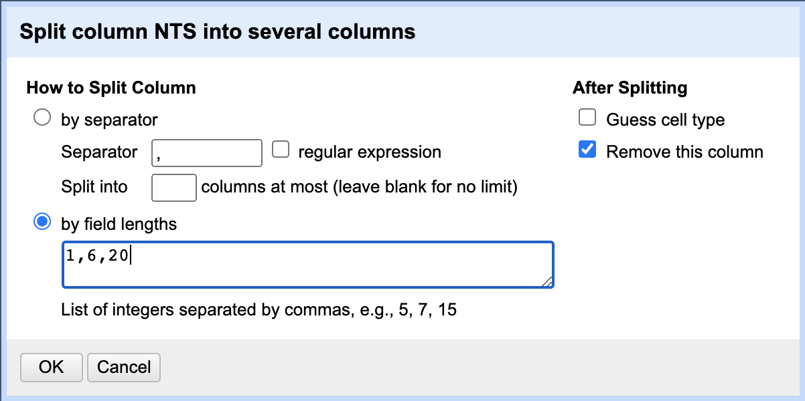

# Cleaning a UBC inventory

If a digital index map exists for a map series and UBC Library has an inventory of their holdings on a spreadsheet, then we can connect the two using GIS. However, we'll first need to make sure that the inventory spreadsheet is properly formatted.

## Identify OpenIndexMap fields in a UBC inventory

The basic steps to complete this part:
1. Review each column and highlight ones that apply to OIM elements.
2. Remove columns that are not highlighted.
3. Export as a .csv.

This part requires a spreadsheet application, like Microsoft Excel or MacOS Numbers.
{: .note}

First, we'll need to make sure that any information contained in the inventories can be cross-walked to the OpenIndexMap (OIM) format standard. Since each UBC inventory spreadsheet is unique, to do this, we will need to manually inspect each one and look for applicable column headers which match OIM elements:

| Element      | Description                                      | Example(s) |
|--------------|--------------------------------------------------|---------|
| <b>label</b> | Alphanumeric code identifying the sheet (<b>mandatory</b>, if available).| 092G14    |
| <b>labelAlt</b> | Alphanumeric code for the sheet that was used in previous or subsequent editions, or for when there are multiple labels| 092G14 East    |
| <b>datePub</b> | Date the sheet was published or made available (<b>mandatory</b>, if available).| 1981-09    |
| <b>dateSurvey</b> | Date the map sheet was surveyed | 1954-03    |
| <b>datePhoto</b> | Date the map sheet was photocorrected | 1990-07    |
| <b>dateReprint</b> | Date the map sheet was reprinted | 1978-12    |
| <b>date</b> | Use when no other date field is relevant | 1922-08-23    |
| <b>location</b> | Geographic place name identifying the area covered by the map sheet (Separate with pipe character; **do not** abbreviate) | British Columbia \| Alaska   |
| <b>scale</b> | Scale statement (representative fraction and qualifiers) of the individual sheet (**Do not** include commas to separate thousands) | approximately 1:12000    |
| <b>title</b> | Title of the map sheet (<b>mandatory</b>, if available) | Riviere Embarrassee    |
| <b>titleAlt</b> | Alternate title, previous title, or subsequent title | Beaver Pond    |
| <b>edition</b> | Statement indicating the edition (Include number only, not publisher initials--e.g., "3 AMS") (<b>mandatory</b>, if available) | "3", "Provisional"    |
| <b>publisher</b> | Publisher of the sheet | Conselho Nacional de Geografia    |
| <b>projection</b> | Information about the map sheet's projection, coordinate system, or datum | UTM 14    |
| <b>lcCallNo</b> | The Library of Congress call number | G3700 s24 .U5    |
| <b>contLines</b> | Indication of whether or not there are contour lines on the map (<b>boolean</b>, lower case) | true    |
| <b>contInt</b> | Contour interval, including units | 20 m    |
| <b>bathLines</b> | Indication of whether or not there are bathymetric lines on the map (<b>boolean</b>, lower case) | false    |
| <b>bathInt</b> | Bathymetric contour interval, including units| 400 ft    |
| <b>inst</b> | Local institution holding the material | University of British Columbia Library    |
| <b>sheetId</b> | Local institution's unique identifier for the sheet | 630cba sheet 14    |
| <b>available</b> | Indication of whether or not an institution holds the sheet (<b>boolean</b>, lower case) (<b>mandatory</b>) | true    |
| <b>physHold</b> | Link to information about the physical object (<b>mandatory</b>, if available) | http://resolve.library.ubc.ca/cgi-bin/catsearch?bid=3711482    |
| <b>digHold</b> | Link to information about the digital object | https://open.library.ubc.ca/collections/ifcsm/items/1.0387689    |
| <b>instCallNo</b> | Call number used locally | G3700 sVAR .U5    |
| <b>recId</b> | Local unique identifier for the digital object | 1.0387689    |
| <b>download</b> | Link to direct download of the item | https://open.library.ubc.ca/media/download/pdf/ifcsm/1.0387689/0    |
| <b>websiteUrl</b> | Link to a website with metadata or other information | https://open.library.ubc.ca/collections/ifcsm    |
| <b>iiifUrl</b> | iiif Manifest URL | https://iiif.library.ubc.ca/presentation/cdm.ifcsm.1-0387689/manifest    |
| <b>notes</b> | Free text for comments and other information | In poor physical condition    |

As columns in the UBC inventories are identified, highlight them or make a note. For example, the UBC inventory for this Canadian topographic map series has several columns that match OIM elements. The screenshot below shows a selection of inventory column headers, with associated OIM elements in red.


Keep in mind that as the inventory columns are compared to OIM elements, there may be inconsistencies that would prevent a straightforward crosswalk. Using the example above, an OIM **location** element could be applied to both the "Prov" and "Other place" columns. For now, this isn't anything to be concerned about--the task at hand is to simply identify columns that can be converted into an OIM element. Later in the process, we will clean up the field names and data, including concatenating two columns, if needed.

Once all columns that can be mapped to OIM elements have been identified, delete the remaining columns. The next step is to transform our columns/values to match the OIM standard.

## Transform columns using OpenRefine

The basic steps to complete this part:
1. Start a new project in OpenRefine with your UBC inventory of OIM columns.
2. Use common OpenRefine functions to transform and clean your columns.
3. Export as a .csv.

This part requires [OpenRefine](https://openrefine.org/) to transform and clean your inventory.
{: .note}

Working toward having an OIM-standardized inventory, the next step will transform the UBC inventory columns and values using functions in OpenRefine. Here are some common OpenRefine functions that will be useful for cleaning up inventories:

### Trim leading and trailing whitespace

This should be done first to all columns.
- Click on a column with values that need to be replaced, then select **Edit cells > Common transforms > Trim leading and trailing whitespace**.

### Mass edit a column
Use this if you need to change a common value of a cell from one thing to another. For instance, if you would like to change all cells with a value "Koerner Library" to instead say "true".
- Click on a column and select **Facet > Text facet**. On the left you should see:


The window above is showing all values listed in the column, with the number of occurrences of that value in gray. In this case, there are 32 occurrences of values that are nothing but whitespace. If you see this, delete any whitespace by hovering over the value and selecting **edit**. Now, delete the whitespace and click **Apply**. This should remove the 32 occurrences of whitespace.

- For the term you would like to mass edit, hover over the value and select **edit**. Then, type the term that should replace it and click **Apply**. In this example, I would like any occurrence of the value "k2 sup." to be "true", since this column will eventually become my OIM "available" element. I will also change "(blank)" to the value "false", since this means that the item is not physically available.


Mass editing a column may also reveal inevitable occurrences of human error when manually creating spreadsheets. For instance, a column with values meant to represent the map scale:

   

It's recommended to fix columns to correct any major instances of human error *with reasonable effort*. This column can be cleaned to fix human error and align with OIM standards:   


### Replace a term or value
Use this if you would like to change all of the occurrences of a term into something else, like changing "BC" to "British Columbia" in an entire column with other values. This is different than mass editing cell values because this will edit a specific term within a cell, not the entire cell value.
- Click on a column with values that need to be replaced, then select **Edit cells > Transform**.
- In the new window's "Expression" box, the expression should read **value.replace('[term]','[replacement]')**. For example, if you would like to replace "NL" with "Newfoundland", this would be the expression:
```
value.replace('NL','Newfoundland')
```
- Click **OK** to execute the changes.

You can also replace multiple values with one single expression:
```
value.replace('NL','Newfoundland').replace('BC','British Columbia').replace('AB','Alberta')
```

### Add a term or value
Use this if you would like to insert a term in the cell value for the entire column, like adding the term "UTM" to a column with just a value for the zone number.
- Click on a column with values that need to be replaced, then select **Edit cells > Transform**.
In the new window's "Expression" box, the expression should read **'[term ]' + value**. For example:
```
'UTM ' + value
```
This expression will turn a column with only the numeric values of UTM zones into the following formate: **UTM 10**.
- Click **OK** to execute the changes.

Notice the "space" within the quotes after "UTM". This will split the two terms, rather than combining them as one.
{: .note}

### Join columns
Use this if you would like to join two columns together, like two different columns with geographic location values.
- Click one column that you would like to join with another, and select **Edit columns > Join columns**.
- On the left, select the second column (and any additional columns) to join.
- For the content separator, refer to the OIM elements, in case values need specific separators. For example, the **location** element requires a pipe character as a separator between values. So, for joining two columns with location values, this will need to be ` | `.
- Select **Skip nulls**. This will keep "separators" from appearing when there is no joined value.
- Select **Delete joined columns** to delete the column that is being joined.


- Click **OK** to execute changes.

### Split a column based on the number of characters
Occasionally, you'll need to split a column into multiple. For instance, if there are multiple sheet names listed and you'd like to separate them into "label" and "labelAlt", you can use this method.

- Click one column that you would like to split, and select **Edit column > Split into several columns...**.
- Select "by field lengths".
- We will need to enter an integer for the characters in this column with which to create each new field. If we have one column with a cell value `x092B11w/B12e` that we want to become 2 columns `x092B11` and `w/B12e`, then we will enter the field lengths 7,6. However, since we may not always know the length of the final column, we can enter a second character length of 20 to be sure we capture all of the remaining "labelAlt" text.
- De-select **Guess cell type**.
- Select **Remove this column**.



- Click **OK** to execute changes.

## Rename columns representing OIM elements in OpenRefine

Once columns are cleaned, they are ready to be renamed as OIM elements. If there are any columns that are not ready for an OIM name, continue transforming in OpenRefine.

When ready, export the spreadsheet as a .csv. OpenRefine will auto-append the format name to the file using a "-". So, be sure to remove it. The naming convention should be something like: `[region]_[scale]_[identifier]_inventory.csv`. For example, the Canadian NTS 1:250,000 scale map series inventory would be **canada_250k_nts_inventory.csv**.
