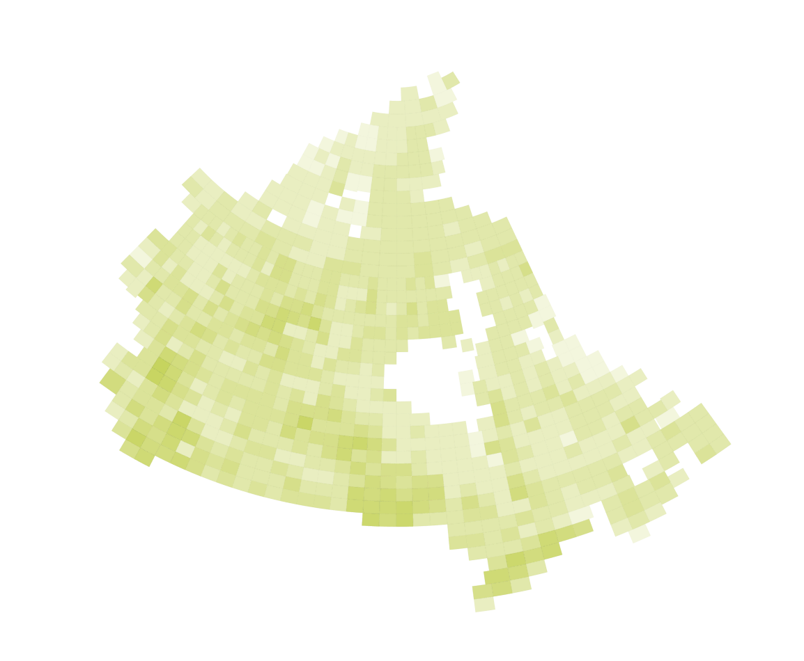
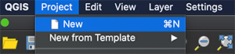
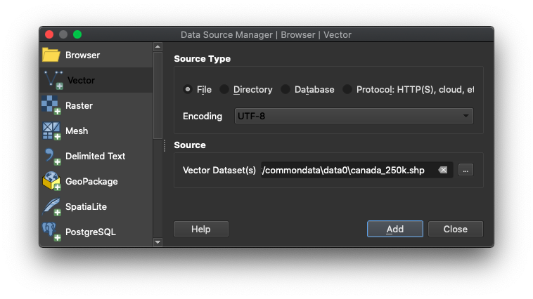
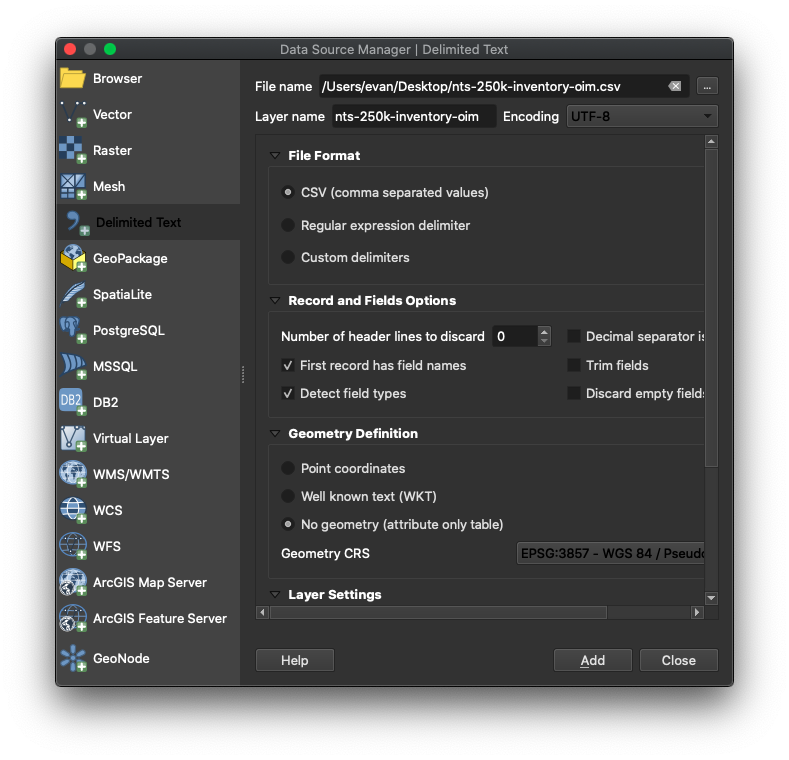
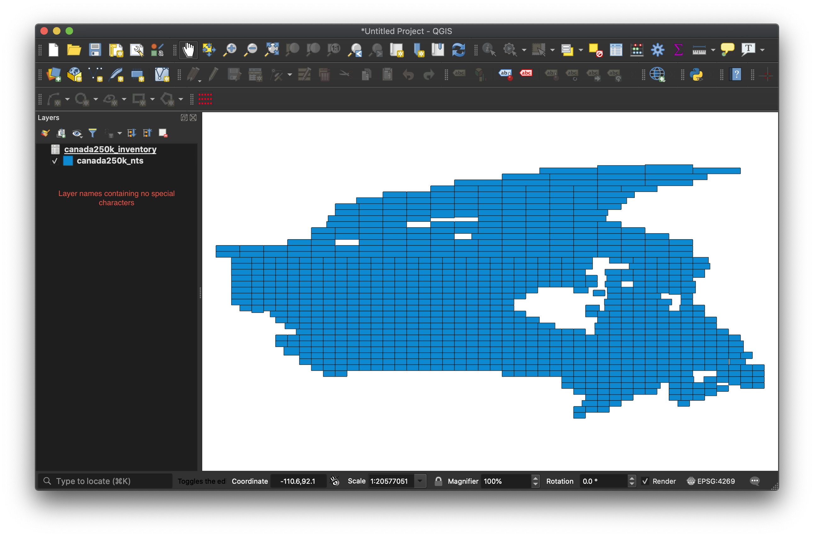
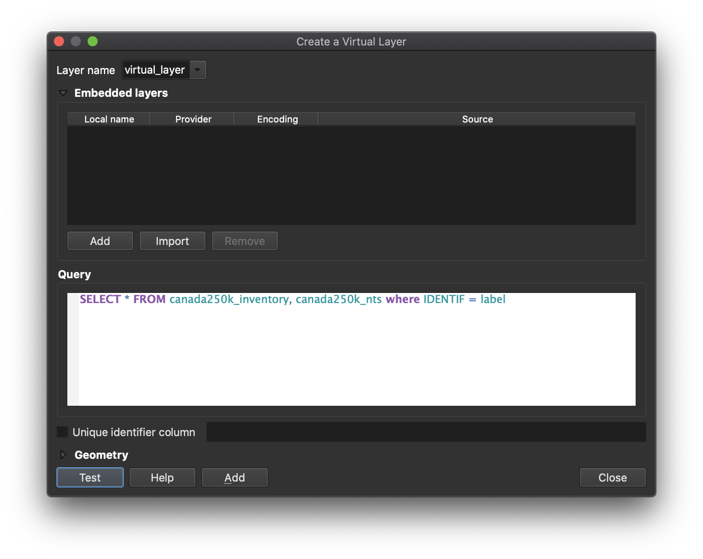
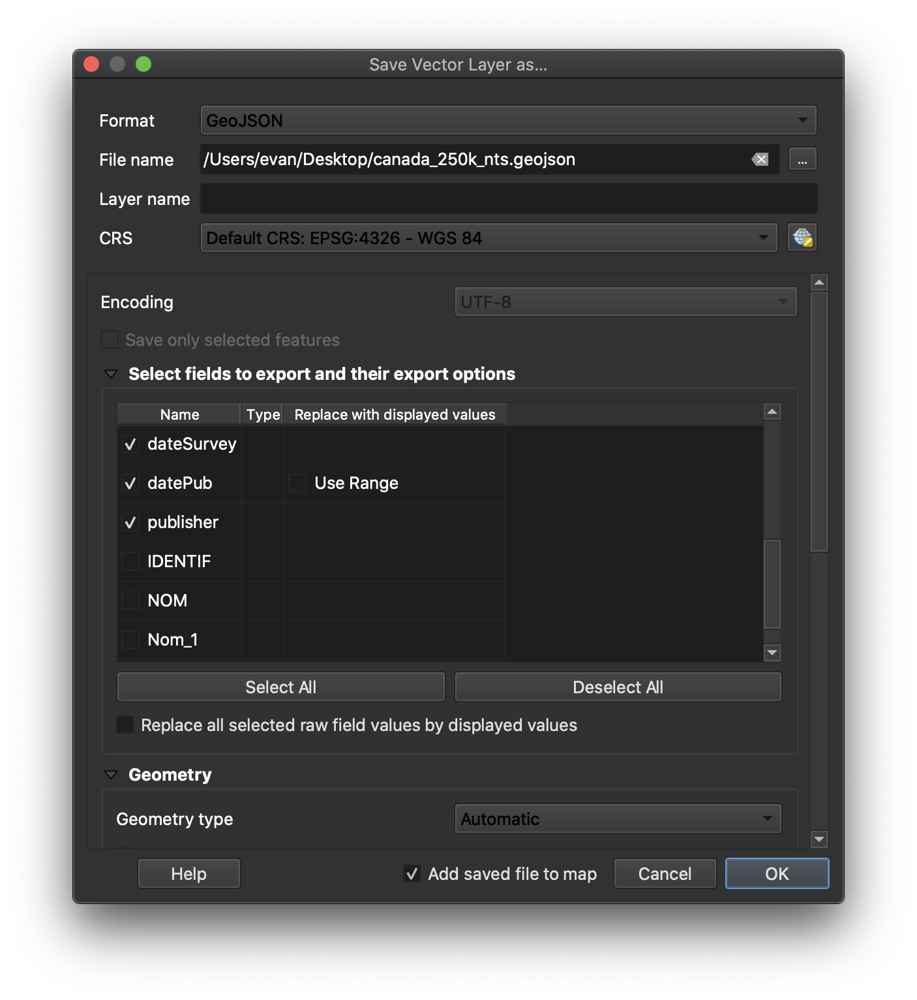

# Create a virtual layer in QGIS
Once both an OIM-compatible spreadsheet and a digital map index exist, we will join the two using QGIS. The main idea is that we will link the two files with a primary key value contained in both. In most cases, this will be the OIM element "label", which holds a value for an alphanumeric sheet ID, but it may also be another sheet-specific element, such as "title".

Because spreadsheets likely contain many rows for one single index grid section (sometimes individual map sheets had many editions!), we will need to treat this "join" as a 1-to-many relationship. In other words, each grid section on the digital map index will need to be connected with many spreadsheet rows. Ideally, the complete OIM digital map index will have "stacked" grid sections--one for each existing map edition--so that, eventually, we can programmatically query values from each stacked feature.

Below is a map of Canada represented by semi-transparent grid sections, with darker colours illustrating where more grid sections are stacked. In those darker areas, more editions of the Canadian 1:250k NTS maps were printed and are available in Koerner Library. With data like this, we can begin to create or use existing applications that allow us to identify all material pertaining to a particular location.



To do this, we will [use QGIS to create a virtual layer](https://docs.qgis.org/3.10/en/docs/user_manual/managing_data_source/create_layers.html#creating-virtual-layers).

The basic steps to complete this part:
1. Add your digital map index and inventory .csv to a QGIS project.
2. Add a new virtual layer from the two using the primary key value.
3. Export as a .geojson.

This part requires use and some knowledge of [QGIS v3.10](https://qgis.org/en/site/).
{: .note}

### Open QGIS and start a new project

Start QGIS, then open a new project. Either select a new project template on opening QGIS, or click **Project > New**.



### Open a digital map index file
Click the **Open Data Source Manager** button (Win: Ctrl + L) (Mac: Command + L). In the new **Data Source Manager** window, select **Vector** from the left, and make sure **Source Type** is **File**. For the **Source** vector file, navigate to and select the digital map index file from your system. Click **Add** and then **Close**. You may have to quickly transform your layer to a new projection.



### Add the spreadsheet inventory
In a new **Data Source Manager** window, select **Delimited Text** from the left, and browse to the file using the **File name** field. For **File Format**, be sure that **CSV (comma separated values)** is selected. For **Geometry Definition**, select **No geometry (attribute only table)**. Other settings can be left as default. Click **Add**, then **Close**.



### Rename the layers
Because in a few steps we'll be using SQL to query our files, we first have to be sure that the names of our two layers do not contain any spaces, /, or -. To do this, rename the layers without those characters. Right-click one of the layer's names and select **Rename**. Now, rename the layer using _ or [camelCase](https://simple.wikipedia.org/wiki/CamelCase). Repeat for the second layer.

If you do not see the names of your layers anywhere, you may need to add your **Layers Panel** by selecting **View > Panels > Layers**.
{: .warn}

You should now see something like this:



### Determine each layer's primary key
We will need to link the two layers together using a common value (a.k.a. primary key, or PK). In most cases, this will be the sheet's alphanumeric identifying number (e.g., 092G), but it may also occasionally be a sheet's title. Each layer *should* contain these values.

For each layer, right-click their name in the **Layers Panel**, and select **Open Attribute Table**. You should now see a table showing all of the attribute (column) values for each feature (row). Attribute *names* are contained in the column headers.

For each layer, find the column header that represents the layer's primary key, and make a note (a mental one, or write it down).

### Refactor primary key fields (where applicable)
In case you determine that primary key fields are not a 1-1 match, we can use the [QGIS **Refactor Fields** tool](https://docs.qgis.org/3.16/en/docs/user_manual/processing_algs/qgis/vectortable.html#refactor-fields) to fix them. This could be used in cases where we've purposefully retained a character (like an "x" to keep fields containing "e" from being converted to scientific notation), or if we've discovered something needing a quick fix after working in OpenRefine.

### Add a new virtual layer
Now, we will relate the two files together using a virtual layer. Select **Layer > Create Layer > New Virtual Layer...**.  

In the new **Virtual Layer** window, we will add a SQL query in the **Query** field. The query will need to use the following format:
```SQL
SELECT * FROM [layer1], [layer2] WHERE [layer1 PK] = [layer2 PK]
```
<br>
For example, these layers would use the following query:

| Layer name           | Column containing primary key values |
|----------------------|--------------------------------------|
| canada250k_nts       | IDENTIF                              |
| canada250k_inventory | label                                |

```SQL
SELECT * FROM canada250k_nts, canada250k_inventory WHERE IDENTIF = label
```
<br>
Once you have assembled your query, select **Test** to identify any potential errors. If no errors, select **Add**, then **Close**. This process could take a moment.



After your query runs, you will see a new layer in your **Layers Panel** named **virtual_layer**, or something similar. Right-click that new virtual layer, and select **Open Attribute Table** to confirm the inventory attributes appear.

### Export your virtual layer as a GeoJSON
Now, we'll save our virtual layer as a GIS file, so we can edit and reuse it. Right-click the new virtual layer, and select **Export > Save Features As...**.

In the new window, we're going to configure our file-to-be. From the format drop-down, select **GeoJSON**.

Click the "three dots" button just to the right of the **File name** field to navigate to the location where the file will be saved.

The file name should include:
- The country or region
- An indication of the maps' scale (or if it varies from sheet to sheet)
- An indication of the title of the series, such as "ams1303"
- Anything else to make it unique (optional)

At UBC Library, we'll follow this general convention, using lowercase characters:
```
[country or region]_[scale]_[title or publisher]_[other info].geojson
```
<br>
For example, the Canadian 1:250,000-scale topographic maps would be:
```
canada_250k_nts.geojson
```
<br>
Back in the **Save Vector Layer as...** window, the **CRS** should be EPSG:4326 - WGS 84.

Below the **CRS** selection, you can now deselect any unneeded attributes in the exported file. Deselect anything that is not OIM compatible.

Be sure to select the option to add the saved file to the map, if you would like to verify it exported correctly.

Click **OK** when finished.


