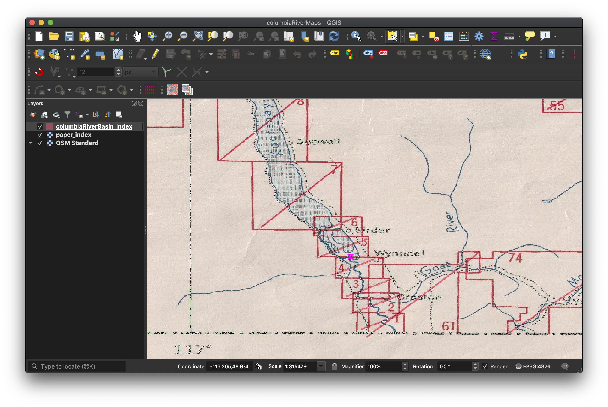
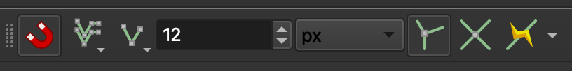
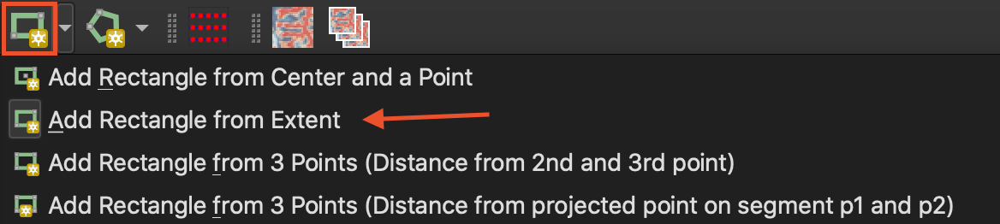

Information about how to scan and trace an index is coming soon!
<!--
Electronic Index: No
Paper map Index: Yes
Rectiliear Grid: No

This should be done if the grid is not rectilinear grids and there is a paper map index. If the grid is rectilinear, then you can [create a grid](#) with QGIS. If the grid is not rectilinear and there is no paper map index:

- if it has lat long at the corners: [create spreadsheet with lat and long columns](#)
- if it does not have lat long at the corners, then use geojson.io or QGIS to [create the index manually](#)
-->

# Scan and Trace a Paper index

The basic steps in this part are:
- Georeference a scanned paper index with QGIS
- Create a new polygon layer with a <code>'label'</code> or <code>'title'</code> field
- Add polygon features to the new layer by tracing the scanned image
- Export the new layer as a GIS file

## Georeference a scanned image
We'll be using these QGIS plugins:
- Georeferencer
- QuickMapServices

**This part coming soon**
## Create a new polygon layer
**This part coming soon**
## Add polygon features for each map area
This section uses a QGIS project [available here](https://drive.google.com/file/d/18bZS1sqoM4F9SjEmoxy4i0MSdyurm5qp/view?usp=sharing) (48 MB .zip).

We'll be using these toolbars:
- Shape Digitizing Toolbar
- Snapping Toolbar

If you don't have these enabled, go to View > Toolbars and select each one.
{: .note}

Once you have your QGIS project open, it should look something like this:

Let's take a quick look at the attribute table, by **right-clicking the layer's title** in the Layers Panel, and **selecting Open Attribute Table**. There is only one field – ``label`` with a string data type. This is going to eventually be used as a joining field or primary key when we link it with a table of data.

### Set Snapping Rules
Snapping allows us to create polygons exactly next to one another without any gaps between them, just as the map sheets represent. In the Snapping Toolbar, click the magnet to enable the snapping options. Be sure to set the configurations to these setting:
- Set for **All Layers**
- Snap on **Vertex and Segment**
The remaining settings can be left at the default. Your setting should look something like this:

### Open Edit Session

Now let's begin editing the empty layer by adding features.
1. Click on your ``columbiaRiverBasin_index`` (or whatever your empty layer's name is) so that it is selected in the **Layers Panel**.
2. Click on the **Toggle Editing** button in your toolbar to start an edit session. This opens up the layer to be modified.

### Begin Tracing Features

For each box on the scanned paper index, we will create a new feature in our empty layer. One-by-one this will become a digital index, which we will eventually export to be joined with more tabular data about each map sheet. Before starting, make sure that you're in an edit mode for the empty layer, and that you have enabled the Shape Digitizing Toolbar.

1. In the **Shape Digitizing Toolbar**, select **Add Rectangle from Extent**. This will turn your cursor into a crosshair, which means QGIS is waiting for you to select your first point of the rectangle.

2. Select a corner of one of the boxes on the scanned paper map, and **drag to the opposite corner**. When you create a box that is the same shape and size as the box on the paper, **right-click** your mouse.

3. After right-clicking, a window will appear prompting you to enter values for the each attribute field. In this case, we just have 'label' (but there could be others to enter here too, depending on the assignment). Enter the 'label' exactly as shown. Click OK and you should see your first polygon.

