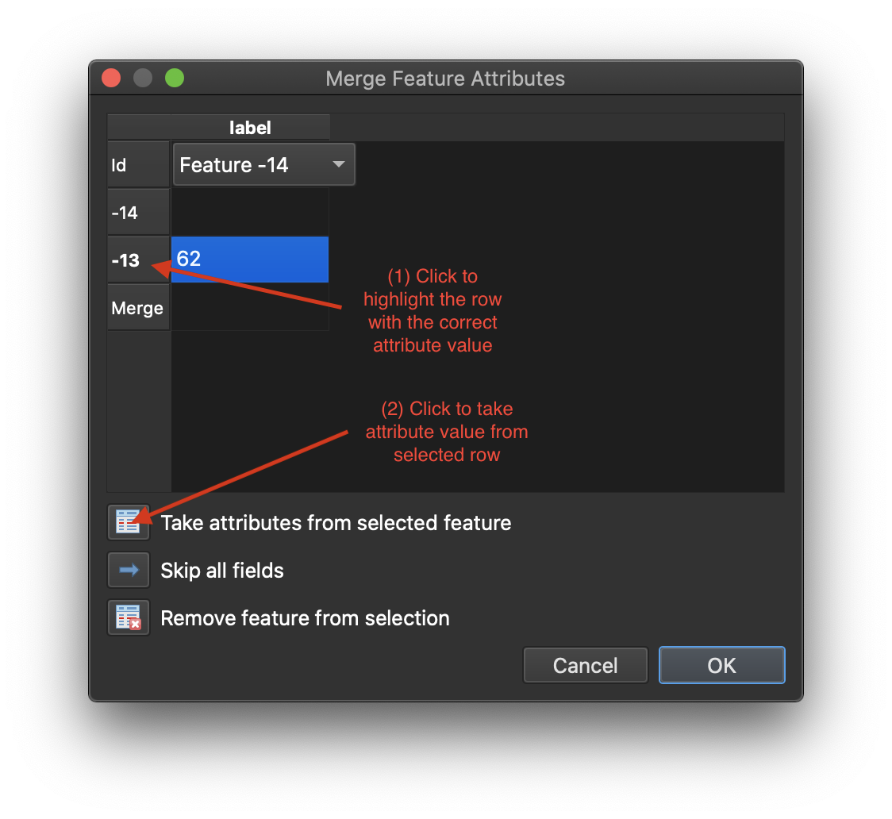

# Scan and Trace a Paper index

The basic steps in this part are:
- Georeference a scanned paper index with QGIS
- Create a new polygon layer with a <code>'label'</code> or <code>'title'</code> field
- Add polygon features to the new layer by tracing the scanned image
- Export the new layer as a GIS file

## Georeference a scanned image
We'll be using these QGIS plugins:
- Georeferencer
- QuickMapServices

**This part coming soon**
## Create a new polygon layer
**This part coming soon**
## Add polygon features for each map area
This section uses a QGIS project [available here](https://drive.google.com/file/d/18bZS1sqoM4F9SjEmoxy4i0MSdyurm5qp/view?usp=sharing) (48 MB .zip).

We'll be using these toolbars:
- Shape Digitizing Toolbar
- Snapping Toolbar

If you don't have these enabled, go to View > Toolbars and select each one.
{: .note}

Once you have your QGIS project open, it should look something like this:

Let's take a quick look at the attribute table, by **right-clicking the layer's title** in the Layers Panel, and **selecting Open Attribute Table**. There is only one field – ``label`` with a string data type. This is going to eventually be used as a joining field or primary key when we link it with a table of data.

### Set Snapping Rules
Snapping allows us to create polygons exactly next to one another without any gaps between them, just as the map sheets represent. In the Snapping Toolbar, click the magnet to enable the snapping options. Be sure to set the configurations to these setting:
- Set for **All Layers**
- Snap on **Vertex and Segment**
The remaining settings can be left at the default. Your setting should look something like this:    

### Open Edit Session

Now let's begin editing the empty layer by adding features.
1. Click on your ``columbiaRiverBasin_index`` (or whatever your empty layer's name is) so that it is selected in the **Layers Panel**.
2. Click on the **Toggle Editing** button in your toolbar to start an edit session. This opens up the layer to be modified.

### Begin Tracing Features

For each box on the scanned paper index, we will create a new feature in our empty layer. One-by-one this will become a digital index, which we will eventually export to be joined with more tabular data about each map sheet. Before starting, make sure that you're in an edit mode for the empty layer, and that you have enabled the Shape Digitizing Toolbar.

In the **Shape Digitizing Toolbar**, select **Add Rectangle from Extent**. This will turn your cursor into a crosshair, which means QGIS is waiting for you to select your first point of the rectangle.    

With your mouse, click a corner of one of the boxes on the scanned paper map, and **drag to the opposite corner**. When you create a box that is the same shape and size as the box on the paper, **right-click** your mouse.    

After right-clicking, a window will appear prompting you to enter values for the each attribute field. In this case, we just have 'label' (but there could be others to enter here too, depending on the assignment). Enter the 'label' exactly as shown. Click OK and you should see your first polygon.    

Navigate to your next polygon location by holding the spacebar and moving your cursor.    
If you'd like to make your new layer translucent to better see features on the paper map layer, right-click your layer and select Properties > Symbology.
{: .note}

The remaining polygons should ideally be exactly next to one another, so we will use the snapping rules we set up earlier. To create your next polygon, start on a segment edge of one you created previously. With snapping enabled, move your cursor next to the polygon edge, and a little pink marker will snap directly to it. Once on the segment, click and drag to create your next polygon and add your attribute values. Repeat this step for the remaining polygons.     

### Create Irregular, Squared-edge Shapes

You may encounter some irregularly shaped maps which will need more than just a rectangle tool. If these shapes have 90-degree corners, we can create multiple rectangles and merge them together into one.     

Create two (or more) polygons for each rectangle making up the polygon using the steps above. When prompted to add attribute values, you don't need to add anything – we'll do that in the next step.

Using the Select Feature(s) tool, select all of the polygons to be merged to that they are highlighted. To select more than one feature, click and drag across them, or hold the Shift key.    

With the features selected, from the main menu, click Edit > Merge Selected Features. This will bring up a new window where you can enter attribute value for the merged object (in the "Merge" row). Enter the value, and click OK.   

### Save and Export

Once finished or when you need and break and want to come back, you can save your edits, features, and project.

- **Save Edits**: This can be done incrementally while working on the project, similar to saving a Word doc or other file. Next to the Toggle Editing button, click in the **Save Layer Edits** button. When you are finished with an editing session, click the Toggle Editing button.

- **Export Features**: Once you're finished making the new layer of polygons, you can export this as a new file. To do this, right-click the layer's name in the Layers Panel, and select Export > Save Features As...   
In this dialog:
    - Format = GeoJSON
    - Filename = [country or region]_[scale]_[title or publisher]_[other info].geojson
    - CRS = EPSG:4326
  Click ok to save    

- **Save Project**: This will let you close QGIS and come back to your project where you left off. You should do this only after you've saved your edits and exported/saved the features. In the main menu, click Project > Save.
